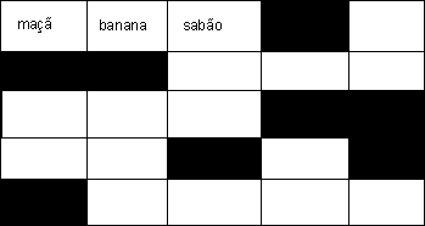
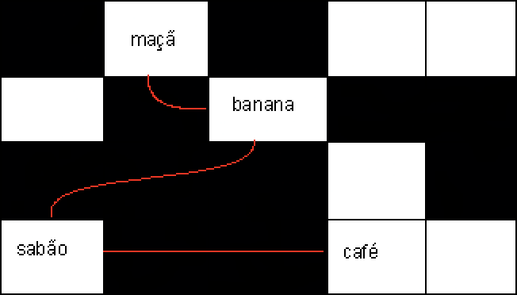

* [Memória](#memoria)
* [Array](#array)
* [Lista](#lista)

Quando a gente aprende a programar por conta própria, fora de um ambiente acadêmico, entender como as coisas funcionam por trás dos panos ou como implementar uma funcionalidade padrão da linguagem não é a primeira coisa que a gente vai procurar.  
É muito provável que você não vá usar *algoritmos e estruturas de dados* no seu dia-a-dia, mas tem algumas bem pequenas e muito úteis que podem melhorar o seu programa. É o caso do título desse post.

Antes de poder decidir qual das duas estruturas usar em cada caso, é preciso entender como cada uma funciona.

## Memória

A memória de um computador funciona como um cofre de banco: várias "gavetas", uma do lado da outra, e cada uma delas só consegue guardar 1 item.

Cada gaveta dessa na memória, assim como num cofre, possui uma identificação. Sempre que você quiser guardar um item nele, você vai pedir ao computador por um espaço, ele vai te dar a identificação do espaço onde o seu item pode ser guardado.

Existem 2 formas básicas de se guardar vários itens, que serão abordadas no texto: **Listas** e **Arrays**.

## Array
&nbsp;

Os itens num Array são armazenados um ao lado do outro, como na imagem acima. Por mais óbvio que pareça ser, nem sempre vai ser a melhor escolha pro que se precisa.
É como se você fosse fazer uma ~~lista~~ *array* de compras e escrevesse os itens numa folha pautada, numerando cada um deles (geralmente começando do 0). Seria bem mais fácil de achar um item que você quer, certo? Se quiser o sétimo item, é só bater o olho na folha e ele vai estar lá, no número 6.  

Na imagem acima a gente tem um array com 3 itens e queremos adicionar mais 1. Como dá pra ver, o espaço na memória ao lado do sabão já está ocupado e, diferente da sua array de compras, não dá pra simplesmente escrever um item em outra folha. É preciso procurar na memória um lugar que possua 4 espaços livres, um ao lado do outro, e é aí que o array pode atrasar o seu programa.

É possível contornar esse problema pedindo para que a memória reserve mais espaços para o seu array, mas o *tradeoff* dessa "solução" pode não valer a pena por dois motivos:
* Você pode acabar não usando todos os espaços que reservou e acabar com espaços livres que não poderão ser utilizado por outros.
- Você pode acabar lembrando de mais itens no futuro e precisar procurar por outro espaço de qualquer forma.

Por guardar um item ao lado do outro, você pode procurar instantaneamente por qualquer item no array através do seu *index*, assim como o sétimo item da sua array de compras, fazendo com que o array seja uma ótima escolha caso você possua um número fixo de itens e queira ler eles de forma aleatória mais rápido.

## Lista
&nbsp;

Numa lista, os itens são armazenados separadamente e cada um deles contém, além do valor armazenado, um "link" para o próximo item da lista.
É como se agora você quisesse escrever a mesma *lista* de compras, mas dessa vez escrevesse cada item em um post-it. Agora se você quiser achar o sétimo item da sua lista, vai ter que passar de um em um, do 0 ao 6.

Na imagem a gente tem uma lista com 4 itens e queremos adicionar mais 1. Sem problema! É só jogar ele em qualquer espaço livre na memória e avisar pro **café**, que é o nosso ultimo item. 

Por ter esse modo mais simples de adicionar um novo item, uma lista é muito útil quando você precisa armazenar cada vez mais itens, mas não tão boa quando precisar ler algum. Se quiséssemos retornar o café, por exemplo, teríamos que passar pela maçã, banana e pelo sabão para encontrá-lo. 

## Bônus

O bônus é só a implementação de uma lista em Java.

~~~Java
public abstract class Lista<T> {
    T head;
    Lista<T> tail;
}

class Cons<T> extends Lista<T> {

    private final T head;
    private final Lista<T> tail;

    public Cons(T head, Lista<T> tail) {
        this.head = head;
        this.tail = tail;
    }

    public T getHead() {
        return head;
    }

    public Lista<T> getTail() {
        return tail;
    }
}

class Empty extends Lista {
    public Empty() {
    }
}
~~~

É possível perceber que uma Lista é uma estrutura recursiva, o que quer dizer que ela chama a si mesma na sua construção. No caso, uma lista é composta por 1 item e um link para uma outra lista, que contém 1 item e um link para uma outra lista, que contém 1 item... e, por fim, o último item sempre irá apontar para uma lista vazia.

~~~Java
public class ListaImpl {

    public static void main(String[] args) {
        Lista<Integer> lista =
                new Cons(1,
                        new Cons(2,
                                new Cons(3,
                                        new Empty())));
    }
}
~~~